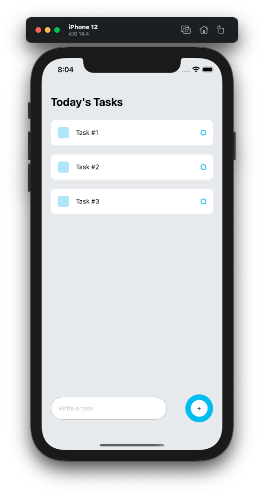

# React Native Todo List

> Super quick and simple Todo list app created with React Native

This quick and dirty app was made by following along with
[Made With Matt's YouTube Tutorial](https://www.youtube.com/watch?v=0kL6nhutjQ8)

Added in Prettier, ESLint, Husky, Lint-Staged, and AsyncStorage for data
persistence

## Post-Mortem

This was my first attempt to create anything with React Native. Definitely
planning on working more with it and seeing how it compares to Xamarin, which
I've used a lot of in the past. App dev is definitely a different beast than web
dev, even in a small todo-list, I'm definitely excited to do more with it.
